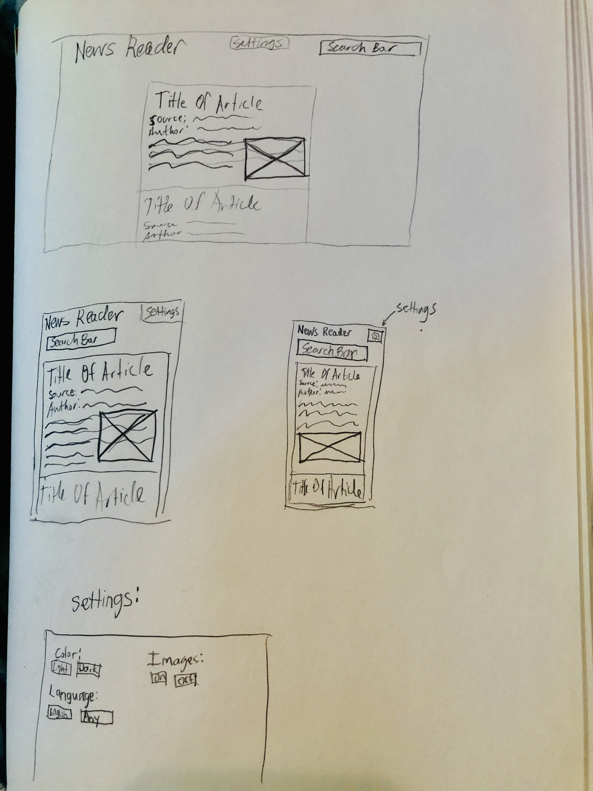

*is this space themed enough?*

# PROJECT 2 README <!-- omit in toc -->

- [Project Planning](#Project-Planning)
  - [Overview](#Overview)
  - [Wireframes](#Wireframes)
  - [MVP](#MVP)
    - [Goals](#Goals)
    - [Libraries](#Libraries)
    - [Data](#Data)
    - [Component Hierarchy](#Component-Hierarchy)
    - [Component Breakdown](#Component-Breakdown)
    - [Component Estimates](#Component-Estimates)
    - [Helper Functions](#Helper-Functions)
  - [Post-MVP](#Post-MVP)
- [Project Delivery](#Project-Delivery)
  - [Code Showcase](#Code-Showcase)
  - [Code Issues & Resolutions](#Code-Issues--Resolutions)

## Project Planning

### Overview

_**News Reader** is an app that will let people search for news. It will allow people to look up any search terms and return relevant articles. It can return articles only from the US or it can return articles from all around the world. It will pull data from the [News API](https://newsapi.org/)._

<br>

### Wireframes

> Use the Wireframes section to display desktop, tablet and mobile views.

<details>



</details>

<br>

### MVP

> The Minimum Viable Product should be a well-planned and easily-communicated product, ensuring that the client's deliverable will be achievable and meet specifications within the time frame estimated.

_The **Project Title** MVP lorem ipsum dolor sit amet, consectetur adipiscing elit. Phasellus dapibus fermentum risus vitae bibendum. Integer vel ipsum mollis odio sollicitudin ornare eu vel ex. In quis fringilla velit, ac maximus quam. Etiam eget placerat neque. Aenean faucibus sem non nisi lobortis ullamcorper._

<br>

#### Goals

- _Working React App_
- _Utilize React Router_
- _6+ Components_
- _Organized File Structure_
- _Utilize Axios_
- _Utilize Grid and/or Flexbox_
- _Desktop, Tablet, and Mobile views_
- _Basic CSS Styles_
- _Incorporate light/dark theme toggle_
- _Remove excess files and code_
- _Remove console.logs_
- _5+ Storybook Components_
- _Display news article details based on search term_
- _Handle errors if user's search term is blank_
- _Link back to original article source_
- _Credit the API with a link in footer, readme, or about/credits page, as required for usage_


<br>

#### Libraries

> Use this section to list all supporting libraries and their role in the project.

|     Library      | Description                                |
| :--------------: | :----------------------------------------- |
|   React Router   | _To create multiple "pages" accessed via different URLs._ |
| Axios | _To pull data from the API._ |

<br>

#### Data

> Use the Data Section to define the API(s) you will be consuming for your project, inluding sample URL queries.

|    API     | Quality Docs? | Website       | Sample Query                            |
| :--------: | :-----------: | :------------ | :-------------------------------------- |
| News API |      yes      | _https://newsapi.org_ | _https://newsapi.org/v2/everything?q=nintendo&apiKey=06c96a58f8e3440fb062458011a729da_ |

<br>

#### Component Hierarchy

> Use this section to define your React components and the data architecture of your app.

```
src
|__ App/
      |__ index.js
      |__ App.css
|__ Header/
      |__ index.js
      |__ Header.css
|__ SiteTitle/
      |__ index.js
      |__ SiteTitle.css
|__ SearchBar/
      |__ index.js
      |__ SearchBar.css
|__ Page/
      |__ index.js
      |__ Page.css      
|__ NewsCard/
      |__ index.js
      |__ NewsCard.css

```

<br>

#### Component Breakdown

> Use this section to go into further depth regarding your components, including breaking down the components as stateless or stateful, and considering the passing of data between those components.

|  Component   |    Type    | state | props | Description                                                      |
| :----------: | :--------: | :---: | :---: | :--------------------------------------------------------------- |
|    App    | functional |   y   |   y   | _The file in which everything will stem from._               |
|    Header    | functional |   n   |   y   | _Will be the header area of the page, including app title and search bar._               |
|    SiteTitle    | functional |   n   |   y   | _Will be the title of the site itself. Will be rendered inside the header._               |
|    SearchBar    | functional |   n   |   y   | _The search bar. Will be rendered inside the header._               |
|    Page    | functional |   n   |   y   | _Essentially the main content container._               |
|    NewsCard    | functional |   n   |   y   | _Will contain the contents of a given news article, including title, author, source, and article description or contents preview._               |
|    _    | functional |   n   |   y   | __               |
|    _    | functional |   n   |   y   | __               |
|    _    | functional |   n   |   y   | __               |
|    _    | functional |   n   |   y   | __               |


<br>

#### Component Estimates

> Use this section to estimate the time necessary to build out each of the components you've described above. 
>
> Time frames are key to the development cycle. You have limited time to code your app, and your estimates can then be used to evalute possibilities of your MVP and post-MVP based on time needed. It's best you assume an additional hour for each component, as well as a few hours added to the total time, to play it safe.

| Task                | Priority | Estimated Time | Time Invested | Actual Time |
| ------------------- | :------: | :------------: | :-----------: | :---------: |
| Add Contact Form    |    L     |     3 hrs      |     2 hrs     |    3 hrs    |
| Create CRUD Actions |    H     |     3 hrs      |     1 hrs     |     TBD     |
| TOTAL               |          |     6 hrs      |     3 hrs     |     TBD     |

<br>

#### Helper Functions

> Use this section to document all helper functions– generic functions that can be reused in other applications.

|  Function  | Description                                |
| :--------: | :----------------------------------------- |
| Capitalize | _Lorem ipsum dolor sit amet, consectetur._ |

<br>

### Post-MVP

> Use this section to document ideas you've had that would be fun (or necessary) for your Post-MVP. This will be helpful when you return to your project after graduation!

- _Add user account and auth capabilities._
- _Utilize the Giphy API to welcome new users with funny gifs._

<br>

***

## Project Delivery

### Code Showcase

> Use this section to include a brief code snippet of functionality that you are proud of and a brief description.

### Code Issues & Resolutions

> Use this section to list of all major issues encountered and their resolution, if you'd like.